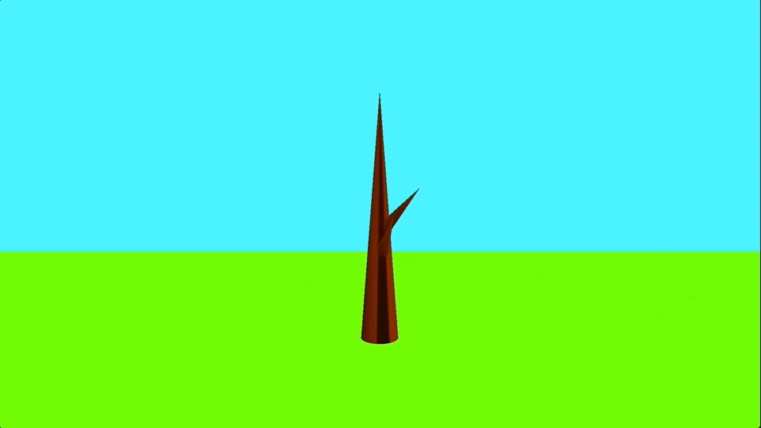

# COMS W4160 Programming Assignment 1
> OpenGL Introduction

## Overview
### Running Part 1
For Part 1, I implemented (1) the `OBJLoader` class, (2) `translate`, `scale`, `rotate` and `reflect` Mesh functions and (3) the model, view and projection transformations.

To run Part 1, run the following command (or you can use `ant run`).
```
$ ant
```

### Running the Creative Scene 
For the [Creative Scene](#creative-scene), I chose to implement a procedurally generated animation of a tree growing.

To run the creative scene, run the following command (the ant build target for the creative scene is `anim`)
```
$ ant anim
```

## Creative Scene

### OBJ Files
To achieve the tree animation I used 3 OBJ files: 
1. plane.obj
2. cone.obj
3. cloud.obj (From [https://www.cgtrader.com/free-3d-models/exterior/landscape/low-poly-clouds-pack-1](https://www.cgtrader.com/free-3d-models/exterior/landscape/low-poly-clouds-pack-1))

### Animation
The scene starts out with 2 planes, one for the ground and one for the background sky, and 1 cone representing the trunk of the tree.

Over time, new, smaller cones appear on the trunk and slowly elongate over time--giving the appearance of new branches sprouting from the tree.

After all branches have been fully grown, tree leaves appear and the tree is fully grown.



### Classes 
The creative scene uses 3 new java classes: 
- `engine/Branch`
- `game/HelloAnim`
- `game/TreeAnim`

The `Branch` class extends `GameItem` to add additional fields such as `center`, `length`, and `maxLength`. These fields track the length and center of the branches in order to more easily perform Mesh transformations to animate the growth of the branches.

`HelloAnim` is a modified version of HelloGame for rendering the animation.

`TreeAnim` is a modified version of Main for running the animation.

**Note**: I have also added fields and functions to the `Mesh` class to modify the position coordinates of the vertex representing the tip of the cone. This allows me to easily "grow" the branch by translating the tip of the `Mesh`.
